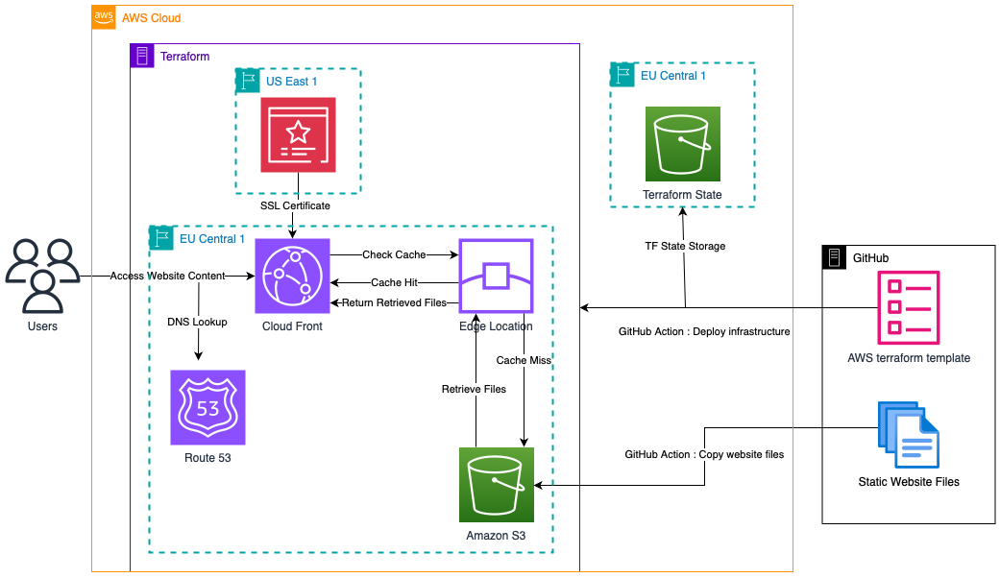
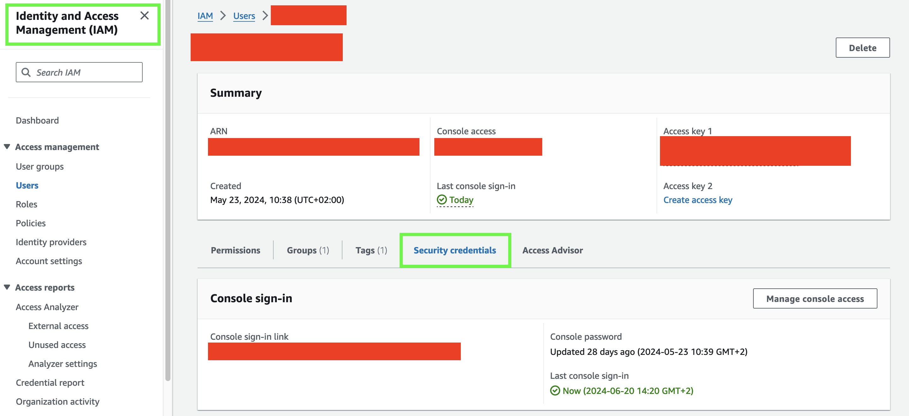
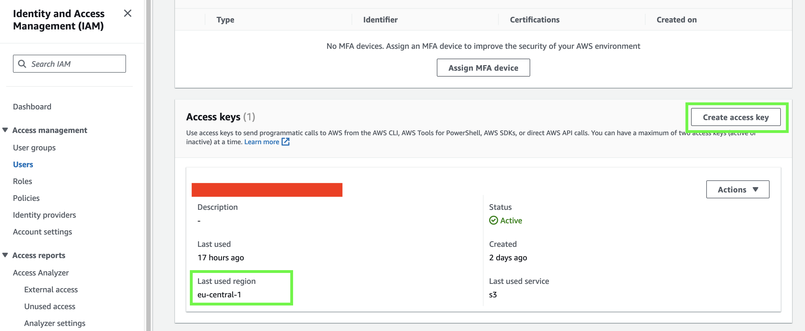
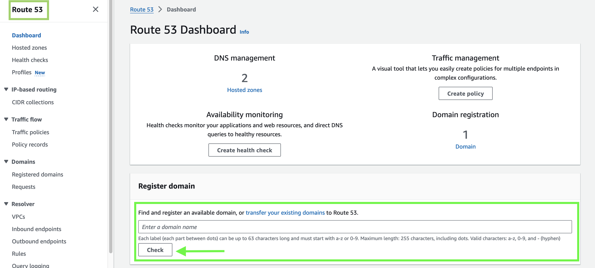
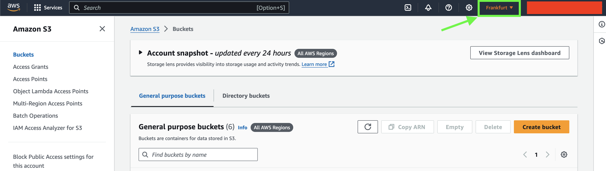
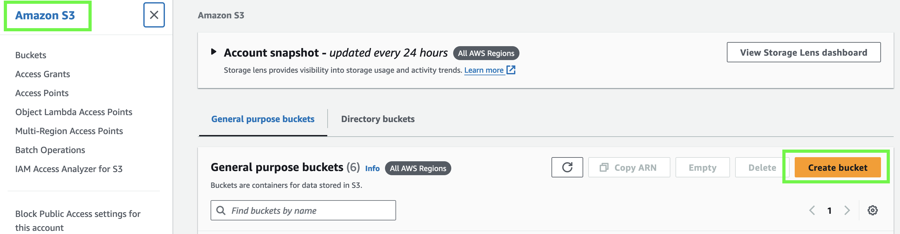
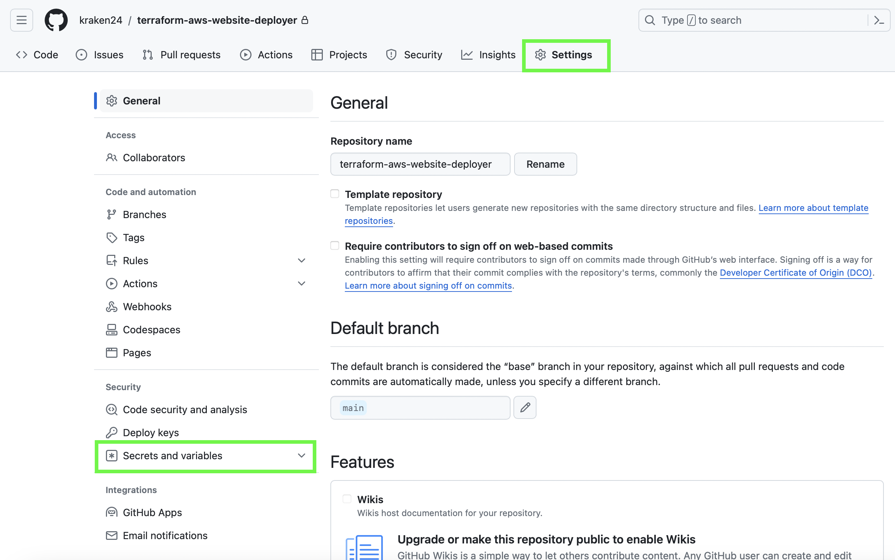

**Effortlessly Deploy Your Personal Website on AWS with Terraform and GitHub Actions for Just €20/Year**
=============================

## Introduction

In today's digital landscape, establishing an online presence is essential, but concerns about complexity and cost often deter individuals from creating personal websites. What if you could deploy a professional website on Amazon Web Services (AWS) seamlessly, leveraging Infrastructure as Code (IaC) with Terraform and automating workflows through GitHub Actions—all for approximately €20 per year? This guide demystifies the process, providing a step-by-step tutorial to help you set up your website efficiently and cost-effectively.

This repository provides you have an opportunity to learn about Terraform & Infrastructure-as-Code, working with Github Actions, and how to deploy a website on AWS.

## Architecture

Here is the architecture diagram of the website deployment: 

## Cost Break-Up

There are two types of costs involved in this project:
1. **One-time Costs (Optional)**: This is the cost of purchasing the website template. There are abundant free website templates available online, so depending on your needs you can either download free templates or purchase online.

    My personal favourite is [theme forest](https://themeforest.net/) website templates. They have a wide variety of website templates. You can also download free word press templates from [HTML5 UP](https://html5up.net).

2. **Infrastructure Costs**: This refers to the cost of using AWS Services. The total cost also depends on which domain name you purchase and how large is the size of the AWS S3 bucket. Below is the detailed breakdown of the infrastructure costs for deploying a portfolio website:

| AWS Service           | Cost (per year)   | Remarks                                            |
|-----------------------|-------------------|----------------------------------------------------|
| Registrar             | € 12.00           | Cost of domain renewal                             |
| Route 53              | € 6.00            | Cost of hosting the domain                         |
| AWS S3                | € 0.20            | Cost of storing website files (HTML / CSS)         |
| Cloud Front           | € 0.00            | Content delivery services from AWS                 |
| Certificate Manager   | € 0.00            | SSL Certificate for the website                    |
| **Total**             | **€ 18.20**       | **Total cost per year**                            |

---

## Project Structure: Set-Up and Deployment

This repository has three sections. I have explained each sectio below, so feel free to skip to whichever part you don't know about.
* ☁️ AWS Account Setup: An AWS account to deploy your website.
* 🐙 GitHub Account Setup: A GitHub account to maintain all the files for this project.
* 🎬 Deployments via Github Actions: There are two pipelines (infrastructure deployment and website deployment) which will automatically deploy everything for you.
    * 🛠️ Terraform configuration in `terraform` folder: This folder contains the AWS infrastructure configuration files. You do not have to change anything here as long as the secrets are stored properly on GitHub :)
    * 🌐 Website files in `my_website` folder: Stores all the required website files in this folder.

---

### AWS Setup

1. Create a AWS Account and an IAM User to deploy the cloud infrastructure. Link to create an IAM User can be found [here](https://docs.aws.amazon.com/IAM/latest/UserGuide/id_users_create.html).
2. For your IAM User, generate access key and secret access key. **Save them in a safe place.**
    1. Go to security credentials tab
    
    2. Scroll down and click on create access key. Please note the region here.
    
3. Buy a domain name from AWS [Route53](https://docs.aws.amazon.com/Route53/latest/DeveloperGuide/registrar-tld-list.html). It will automatically create a Route53 hosted zone. You will require the `hosted_zone_id` and `domain_name` for the next steps.

4. Create AWS S3 bucket for storing terraform backend state securely. Here two values are very important, the **bucket name** and the **AWS region** where this bucket is stored. We will assign these values to `BACKEND_BUCKET_NAME` and `BACKEND_BUCKET_REGION` in github. Select the region closest to your geographical location.
    1. Select AWS region from drop-down
    
    2. Click Create bucket and assign a very unique bucket name. You could use `tfstate.<domain-name>` as bucket name.
    
    3. Enable bucket versioning and create the bucket.

---

### GitHub Setup

1. Create a GitHub account to maintain all the files for this project.
2. Fork this [repository](https://github.com/kraken24/personal-website-with-terraform) from GitHub and clone it locally.
3. In the settings tab, go to `Secrets and variables` tab, click on `Actions` and add secrets.

4. Add secret `Name`: `Secret`value as follows:

| Name                       | Secret                       | Remarks                                             |
|----------------------------|------------------------------|----------------------------------------------------|
| `TF_VERSION`               | 1.8.5                        | The version of terraform to be used.    |
| `BACKEND_BUCKET_NAME`      | tfstate.your-domain-name     | The name of AWS S3 bucket to store terraform backend          |
| `BACKEND_BUCKET_REGION`    | eu-central-1                 | The AWS region where the bucket for terraform backend is created  |
| `AWS_ACM_REGION`           | us-east-1                    | The AWS region to provision SSL Certificates. This region should always be **`us-east-1`** |
| `DOMAIN_BUCKET_NAME`       | your-domain-name             | The name of AWS S3 bucket to store your website files. I would recommend it to be same as your domain name.  |
| `DOMAIN_BUCKET_REGION`     | eu-central-1                 | The AWS region where the domain bucket should be created.          |
| `ROUTE53_DOMAIN_NAME`      | your-domain-name             | The domain name you purchased for your website.         |
| `ROUTE53_HOSTED_ZONE_ID`   | your-route53-hosted-zone-id  | The hosted zone id created by route 53 for your domain.          |
| `ROUTE53_RECORD_TTL`       | 600                          | The time-to-life (TTL) for your website files.                  |
| `AWS_ACCESS_KEY_ID`        | access-key                   | The access key for your IAM User.                             |
| `AWS_SECRET_ACCESS_KEY`    | secret-access-key            | The secret access key for your IAM User.                      |
| `AWS_REGION`               | eu-central-1                 | The default AWS region. I would recommend it to be same as the region where you create your bucket for storing website files.  |

---

### Deployments

1. `.github/workflows` folder contains two automation pipelines.
2. The `deploy_infra.yml` pipeline will setup the required AWS infrastructure (creating S3 bucket, CloudFront distributions etc.).
    1. The pipeline will be triggered whenever the files are changed in `terraform` folder and the changes are pushed to `main` branch. See the trigger [lines 3-8](https://github.com/kraken24/terraform-aws-website-deployer/blob/ed6148bd07a7114332195eb6e6295ac70aec661b/.github/workflows/deploy_infra.yml#L3C1-L8C23).
3. The `upload_to_s3.yml` pipeline will copy your website files to AWS S3 bucket which will be used to render your website.
    1. The pipeline will be triggered whenever files are changed in `my_website` folder and the changes are pushed to `main` branch. See the trigger [lines 3-8](https://github.com/kraken24/terraform-aws-website-deployer/blob/ed6148bd07a7114332195eb6e6295ac70aec661b/.github/workflows/upload_to_s3.yml#L3C1-L8C23).
4. See below the changes you have to make to trigger the pipelines.

#### Terraform Files

1. Create a branch from `main` and name it `feature/terraform_deployment`.
2. Create a dummy text file in `terraform` folder called `terraform_deployment.txt`
3. Commit the file and merge to main. This will trigger the pipeline to setup the AWS infrastructure.
4. ⚠️ **This step is necessary as the automation pipeline and terraform requires a few minutes to deploy everything on AWS. If this step is combined with next step or ignored then sometimes, all the infrastructure elements are not deployed in time and the website might not be published properly.**

#### Website Files

1. Create a branch from `main` and name it `feature/website_updation`.
2. Download the website template files of your choices from a wide range of online websites. My recommendations are:
    * [Paid Interactive Websites](https://themeforest.net/)
    * [Free HTML5 Websites](https://html5up.net/)
3. Update the downloaded website files with your personal information.
4. Commit / Upload all files into `my_website` folder and merge to main. This will trigger the pipeline to deploy your website.

---

## Conclusion

The above steps should deploy your personalised website on AWS.

**Contributing**

If you'd like to contribute to this project, please feel free to open a pull request. Or if you have suggestions, feel free to write to me at `kraken2404@gmail.com`.

**License**

This project is licensed under the MIT License. See [LICENSE](LICENSE) for details.

**Acknowledgments**

I hope this README provides a helpful overview of how to deploy and manage this personal portfolio website using AWS, Terraform, and GitHub Actions.
